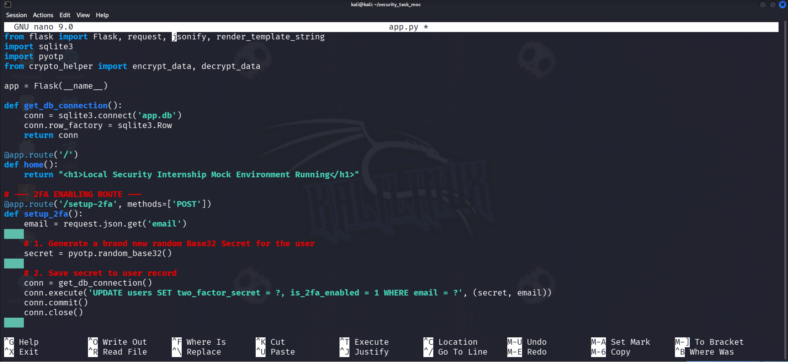

# Secure Backend Authentication & Data Protection Lab (Flask + SQLite)

> A hands-on cybersecurity project demonstrating **Google OAuth 2.0 Authentication**, **Two-Factor Authentication (2FA)** using Google Authenticator, and **AES-256-GCM Encryption** in a local Flask application running on Kali Linux.

---

## Project Overview

This project simulates a secure backend environment without relying on an external database or cloud infrastructure. Everything is built locally using **Python**, **Flask**, and **SQLite**, making it ideal for cybersecurity students, interns, and beginners learning secure application development.

The project demonstrates three fundamental security mechanisms used in modern applications:

- Google OAuth 2.0 Authentication
- Google Authenticator (TOTP-based 2FA)
- AES-256-GCM Encryption for Sensitive Data at Rest

---

# Project Architecture

```
                +----------------------+
                |      User Browser    |
                +----------+-----------+
                           |
                    Google OAuth Login
                           |
                           ▼
                    +--------------+
                    | Flask Server |
                    +------+-------+
                           |
        +------------------+------------------+
        |                  |                  |
        ▼                  ▼                  ▼
 Google OAuth         AES-256 Engine       2FA Engine
 Authentication       Encrypt/Decrypt      Google Authenticator
        |                  |                  |
        +------------------+------------------+
                           |
                           ▼
                     SQLite Database
```

---

# Project Structure

```
security_task_mock/
│
├── app.py
├── crypto_helper.py
├── db_setup.py
├── app.db
├── mock_users.csv
├── requirements.txt
├── images/
│   ├── initial_setup.png
│   ├── data_generation.png
│   ├── db_setup.png
│   ├── crypto_helper.png
│   ├── app.png
│   └── encrypted_record.png
│
└── README.md
```

---

# Technologies Used

- Python 3
- Flask
- SQLite3
- Google OAuth 2.0
- PyOTP
- Cryptography
- AES-256-GCM
- Mockaroo
- Kali Linux

---

# Features

- Google OAuth Login
- Google Authenticator Integration
- Time-Based One Time Password (TOTP)
- AES-256-GCM Encryption
- SQLite Database
- Local Testing Environment
- Mock User Dataset
- REST API Endpoints

---

# 🛠 Step 1 - Setting up the Environment

Create the working directory.

```bash
mkdir -p /home/kali/security_task_mock
cd /home/kali/security_task_mock
```

Create a virtual environment.

```bash
python3 -m venv venv
```

Activate it.

```bash
source venv/bin/activate
```

Install dependencies.

```bash
pip install Flask pyotp cryptography requests google-auth google-auth-oauthlib python-dotenv
```

---

## Environment Setup

> Save the following image inside **images/** as **initial_setup.png**

```text
images/initial_setup.png
```


---

# Step 2 - Generate Mock Dataset

Use **Mockaroo** to generate realistic user data.

Required fields:

| Field | Type |
|---------|------------|
| id | Row Number |
| username | Username |
| email | Email |
| password_hash | MD5 |
| sensitive_info | Phone |

Generate

- CSV
- 100 rows

Save it as

```
mock_users.csv
```

---

## Mockaroo Configuration

```text
images/data_generation.png
```


---

# Step 3 - Database Setup

The project imports the generated CSV into SQLite.

Database fields include

- Username
- Email
- Password Hash
- Encrypted Sensitive Data
- 2FA Secret
- 2FA Status

---

## Database Setup Code

```text
images/db_setup.png
```


---

# Step 4 - AES-256-GCM Encryption

Sensitive information is encrypted before being stored.

Encryption uses

- AES-256
- GCM Mode
- Random 96-bit IV
- Authenticated Encryption

The encrypted data is stored as a binary blob.

---

## Encryption Helper

```text
images/crypto_helper.png
```


---

# Step 5 - Flask Backend

The Flask backend provides APIs for

- Google OAuth Login
- OAuth Callback
- 2FA Setup
- 2FA Verification
- Encryption
- Database Access

---

## Flask Application

```text
images/app.png
```



---

# AES-256 Encryption Demonstration

Store encrypted data.

```python
encrypted_blob = encrypt_data("+923001234567")
```

Store into SQLite.

```python
INSERT INTO users
```

Retrieve.

```python
decrypt_data(blob)
```

---

## Encrypted Record

```text
images/encrypted_record.png
```


---

# Google OAuth 2.0 Flow

```
Browser
     │
     ▼
Google Login
     │
     ▼
Google Consent Screen
     │
     ▼
Authorization Code
     │
     ▼
Flask Callback
     │
     ▼
User Profile Retrieved
```

---

# Google Authenticator (2FA)

Generate Secret

```python
secret = pyotp.random_base32()
```

Generate QR/URI

```python
totp.provisioning_uri(...)
```

Verify

```python
totp.verify(code)
```

---

# Running the Application

Delete the previous database.

```bash
rm -f app.db
```

Run the application.

```bash
python3 app.py
```

---

# Test Google OAuth

Open

```
http://127.0.0.1:5000/login-google
```

Google will authenticate the user and redirect back to Flask.

---

# Test AES Encryption

Insert encrypted data.

```bash
python3 -c "
import sqlite3
from app import encrypt_data

conn = sqlite3.connect('app.db')

encrypted_blob = encrypt_data('+923001234567')

conn.execute(
'INSERT INTO users(username,email,sensitive_info) VALUES(?,?,?)',
('security_intern','intern-test@example.com',encrypted_blob)
)

conn.commit()
conn.close()

print('Encrypted record stored successfully.')
"
```

---

View encrypted blob.

```bash
python3 -c "
import sqlite3

conn = sqlite3.connect('app.db')

user = conn.execute(
'SELECT * FROM users WHERE username=\"security_intern\"'
).fetchone()

print(user[4])

conn.close()
"
```

---

Decrypt the data.

```bash
python3 -c "
import sqlite3
from app import decrypt_data

conn = sqlite3.connect('app.db')

user = conn.execute(
'SELECT * FROM users WHERE username=\"security_intern\"'
).fetchone()

print(decrypt_data(user[4]))

conn.close()
"
```

---

# Configure 2FA

```bash
curl -X POST http://127.0.0.1:5000/setup-2fa \
-H "Content-Type: application/json" \
-d '{"email":"intern-test@example.com"}'
```

Copy the secret into Google Authenticator.

---

# Verify 2FA

```bash
curl -X POST http://127.0.0.1:5000/verify-2fa \
-H "Content-Type: application/json" \
-d '{"email":"intern-test@example.com","code":"123456"}'
```

Expected response

```json
{
    "status":"Success",
    "message":"2FA Code Accepted!"
}
```

---

# Learning Outcomes

By completing this lab, you will understand

- OAuth 2.0 Authentication
- Authorization Code Flow
- Google Identity APIs
- Time-based One-Time Passwords (TOTP)
- Google Authenticator
- SQLite Integration
- Flask REST APIs
- AES-256-GCM Encryption
- Encryption at Rest
- Secure Backend Development

---

# Security Concepts Covered

- Authentication
- Authorization
- Identity Management
- MFA (Multi-Factor Authentication)
- Symmetric Encryption
- AES-256
- Secure Key Management
- Nonce Generation
- Authenticated Encryption
- Data Confidentiality

---

# Future Improvements

- JWT Authentication
- Password Hashing with Argon2
- PostgreSQL
- Docker Deployment
- HTTPS with Nginx
- QR Code Generation for 2FA
- Environment Variables
- Role-Based Access Control (RBAC)

---


Hands-on Cybersecurity Labs | SOC | Python | Flask | Cryptography | Authentication | Secure Backend Development

---

# ⭐ If you found this project useful

Give the repository a ⭐ and share it with others interested in learning secure backend development.
